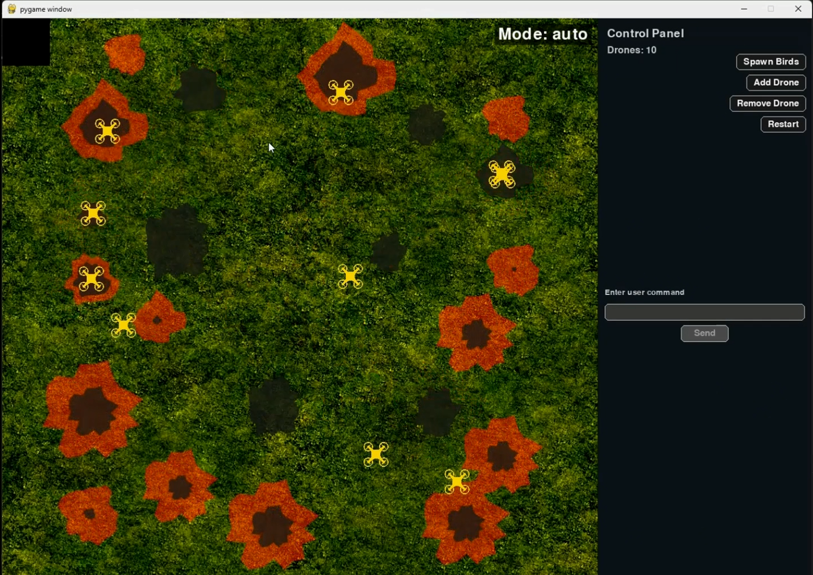
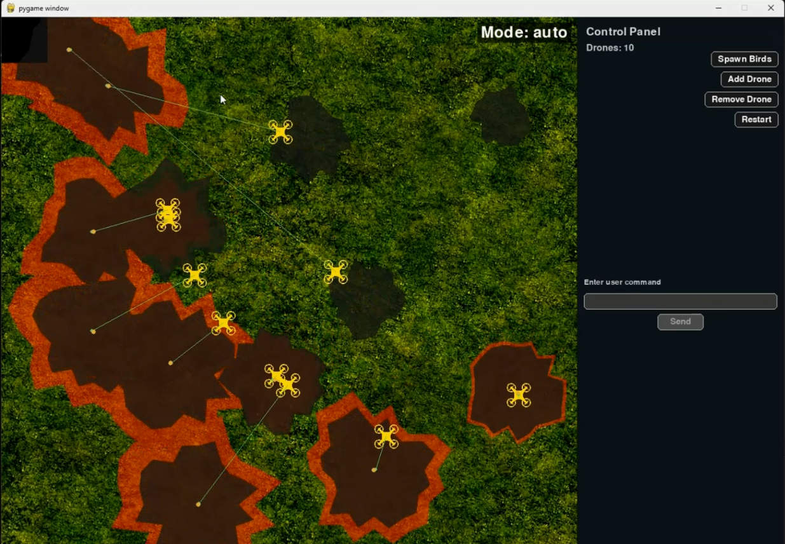
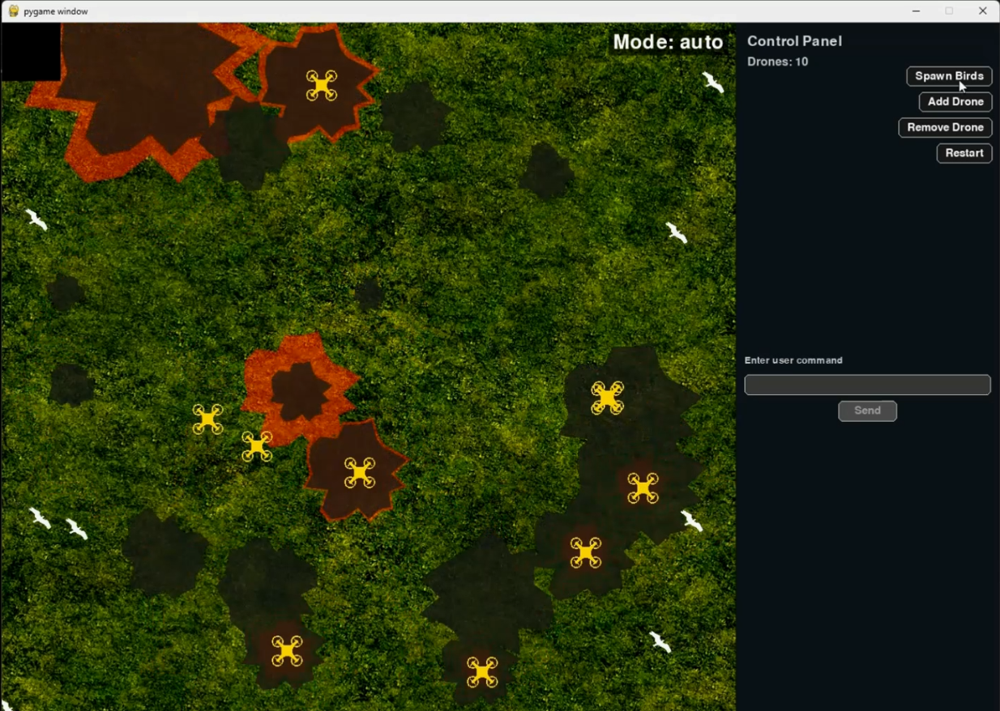
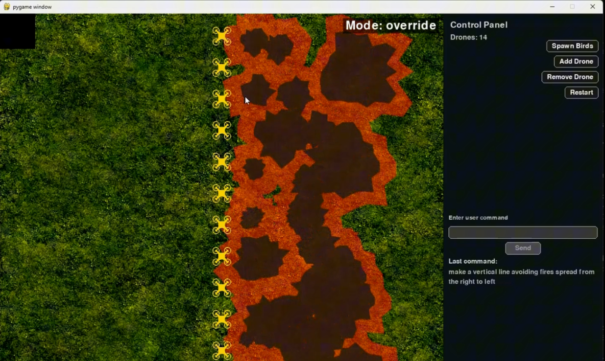
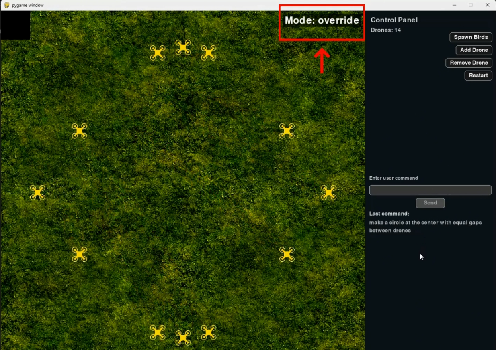
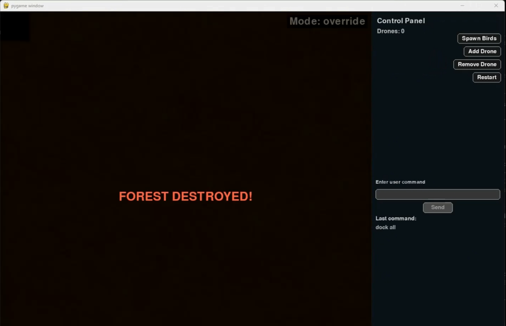

# Multi-Agent Fire Extinguish Drone System

A compact multi-agent Pygame simulation where autonomous drones extinguish procedurally spreading fires. The project includes an in-game CrewAI-powered chat interpreter for high-level operator commands, a right-side control sidebar, and visual debugging overlays.

Entry point: `main.py`

## Quick start (Windows PowerShell)

```powershell
python -m venv .venv
.\.venv\Scripts\Activate.ps1
python -m pip install --upgrade pip
python -m pip install -r requirements.txt
# optionally set an API key for LLM features
# $env:OPENAI_API_KEY = "your_api_key_here"
python main.py
```

## What this does
- Simulates fires that grow and spread across a forested playground.
- Autonomous drones move to fire centers and extinguish fires (assignment is proportional to fire severity).
- An integrated CrewAI interpreter maps natural-language chat to structured drone commands (dock, move, resume, etc.).
- A right-side sidebar provides controls: Spawn Birds, Add/Remove Drone, Restart, and an in-GUI chat box.

## Key features (short)
- Proportional multi-fire allocation and sticky assignments (drones keep assigned fires until extinguished).
- Docking protection: drones docking are not reassigned mid-dock.
- Irregular, seeded fire shapes for more realistic visuals.
- Debug overlay (press `D`) — shows per-drone target lines and states.
- Clean terminal: routine runtime logs are suppressed; use the debug overlay for runtime inspection.

## Resources / UI screenshots

<div style="display: flex; flex-wrap: wrap; gap: 10px;"> <div style="flex: 1; min-width: 45%;">  <p align="center"><em>Agent functionality (overview)</em></p> </div> <div style="flex: 1; min-width: 45%;">  <p align="center"><em>Agent function with tracking visualized (press D)</em></p> </div> <div style="flex: 1; min-width: 45%;">  <p align="center"><em>Bird flock appearing in the playground</em></p> </div> <div style="flex: 1; min-width: 45%;">  <p align="center"><em>User command override (targeted)</em></p> </div> <div style="flex: 1; min-width: 45%;">  <p align="center"><em>User command override (global/all)</em></p> </div> <div style="flex: 1; min-width: 45%;">  <p align="center"><em>Failure case: agent fails to extinguish a fire</em></p> </div> </div>


## Notes
- Dependencies: see `requirements.txt`. Installing the full list enables CrewAI features; `pygame` alone runs the simulation without LLM.
- If CrewAI integration is used, ensure your API key is available in the environment or `.env` file.
- For troubleshooting, run the simulation and press `D` to enable the debug overlay which exposes per-drone state and target lines.

If you want, I can move any existing screenshots from `images/` to `resources/` and rename them to match the UI list above.
## Multi-Agent Fire Extinguish Drone System

This repository contains a multi-agent simulation built with Pygame and CrewAI. The simulation models
a forest playground where user-created fires spread, autonomous drones extinguish fires, and an
LLM-based interpreter (CrewAI) converts operator chat into structured drone commands.

Entry point: `main.py`.

Basic idea / how the system works
- Fires: left-click on the playground area to start a new fire. Fires grow over time and create ash (burned area). If the whole forest becomes ash, the simulation displays "FOREST DESTROYED!" and freezes.
- Drones: drones have position, a target, and an optional assigned fire center. In automatic mode (`auto`) drones are assigned to fires using the proportional allocation algorithm described above. Drones move to targets and reduce a fire's radius when inside the fire area.
- Birds: spawn birds using the "Spawn Birds" button in the sidebar. Drones will steer away from nearby birds.
- LLM / CrewAI interpreter: the in-GUI chat sends natural-language instructions to the CrewAI interpreter. The interpreter maps inputs to one of the supported actions (dock, move, check fire, resume, none) and the simulation applies the structured command.

Controls
- On startup, the simulation creates 4 drones by default. Use the sidebar buttons to add/remove drones at runtime.
- In the Pygame window:
  - Left-click the playground (left area) to start a fire (clicks on ash are ignored).
  - Use the sidebar buttons:
    - Spawn Birds — create a flock that traverses the playground.
    - Add Drone — create a new drone at the dock.
    - Remove Drone — remove the most recently-created drone.
    - Restart — reset fires, ash, birds and user instructions, and reset the drone count and positions to the default (4 drones docked).
  - Debug overlay: press `D` to toggle debug drawing (lines to targets, per-drone statuses in sidebar).

CrewAI chat
- Use the text field in the right-side sidebar and click "Send" (or press Enter while the chat box is focused) to send a natural-language instruction to the interpreter.
- Example inputs:
  - everyone dock
  - dock drone1
  - move drone1 to 650,800
  - make a circle
  - resume

Requirements
- Python 3.10+
- pygame
- python-dotenv (optional)
- crewai (and any provider-specific libraries required by your chosen LLM)

See `requirements.txt` for the full list. Installing the full list enables the CrewAI features; installing only `pygame` and `python-dotenv` is enough to run the simulation without LLM control.

Run (Windows PowerShell)
1. Create and activate a virtual environment:

```powershell
python -m venv .venv
.\.venv\Scripts\Activate.ps1
```

2. Install dependencies (recommended):

```powershell
python -m pip install --upgrade pip
python -m pip install -r requirements.txt
```

3. Set your LLM API key in a `.env` file or environment variable (if you want CrewAI features):

```text
OPENAI_API_KEY=sk-...
```

or in PowerShell:

```powershell
$env:OPENAI_API_KEY = "your_api_key_here"
```

4. Run the simulation:

```powershell
python main.py
```
